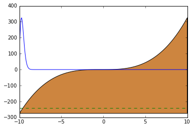

# Cuantica Jupyter
Este repositorio es resultado del proyecto de investigación del Semillero de Física Teórica y Computacional de la Universidad de EAFIT del año 2015 sobre el uso de la física computacional para la asistencia de la enseñanza de la mecánica cuántica.  

  

El proyecto se apoya en el uso de la plataforma [Jupyter](http://jupyter.org/) para la implementación de sesiones interactivas que permiten combinar texto, matemáticas y código ejecutable sin cambiar de aplicación. Se recomienda el uso del servicio en linea [SageMath Cloud](https://cloud.sagemath.com/) para su ejecución, lo que permite una mayor accesibilidad al recurso.  
## Notebooks
Se encontraran los siguientes notebooks:  
 * [Visualización e interacción](vis_int.ipynb): Describe los métodos de gráficación usados y una breve discusión sobre el módulo matplotlib y bokeh, así como de consideraciones de visualización de los elementos de apoyo.  
 * [Técnicas numéricas](tecnicas_numericas.ipynb): Se describen las técnicas de búsqueda de raíces de búsqueda incremental y bisección para asistir la búsqueda de autovalores en el método del disparo con el algoritmo de Numerov. Se describe este último támbien así como el uso de la adimensionalización de la ecuación de Schrödinger como mecanismo de control de error numérico debido al orden de magnitud de los valores de los aprametros en unidades tradicionales (SI).  
 * [Estados ligados](estados_ligados.ipynb): Se usan los elementos desarrollados en los notebooks anteriores para el apoyo a la exploración de parametros en la solución de estados ligados.  
 * [Radiación de cuerpo negro](Blackbody_radiation.ipynb).  
 * [Superposición y paquete de onda](Superposicion.ipynb).  

### Módulos  
Por comodidad las funciones necesarias desarrolladas en los notebooks se encuentras disponibles en módulos python.  
* [vis_int](vis_int.py).  
* [tecnicas_numericas](tecnicas_numericas.py).  
* [estados_ligados](estados_ligados.py).  

## Reporte  

Se disponen en el repositorio los archivos fuente y complementarios para la compilación LaTeX del reporte del proyecto.  
* [Documento principal](ReporteArticulo.tex).
* [Bibliografía](reporte.bib).
* Versiones estáticas en pdf de los notebooks anexas al reporte:  
	* [Visualización e interacción](vis_int.pdf).
	* [Técnicas numéricas](tec_num.pdf).
	* [Estados ligados](est_lig.pdf).  

El archivo pdf se encuentra compilado para consulta [aquí](ReporteArticulo.pdf).  

## Licencia  
Para fines de uso de este material, el proyecto se encuentra con licencia [MIT](LICENSE).  

## Contribuciones  
* [Edward Villegas](https://github.com/orgs/fisicatyc/people/cosmoscalibur)
* [Mario Velez](https://github.com/orgs/fisicatyc/people/marioelkinvelez)
* [Melissa Muñoz](https://github.com/orgs/fisicatyc/people/melissaml05)
* [Juan Jose Cadavid](https://github.com/orgs/fisicatyc/people/Renzerth)
* [Nicolas Guarin](https://github.com/nicoguaro)

